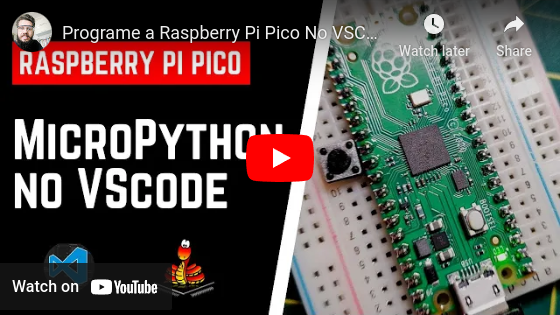

# owi-station
Este repositório contém o código final que integra todos os sensores desenvolvidos para a estação meteorológica. Para desenvolvimento, foi utilizada a placa Raspberry Pi Pico.

O projeto adere, na medida do possível, o [guia de padronização](https://github.com/open-weather-iot/template-module) para facilitar contribuições, integração e entendimento do projeto.

# Instruções (testado em Linux)
Para gravar os códigos, é possível utilizar a ferramenta *ampy: Adafruit MicroPython*  (`pip install adafruit-ampy`):
```sh
ampy -p /dev/ttyACM0 put lib
ampy -p /dev/ttyACM0 put src
ampy -p /dev/ttyACM0 put util
ampy -p /dev/ttyACM0 put main.py
```

Para interagir com a placa, executando comandos e analisando os *print's*, podemos usar o *minicom*:
```sh
minicom -D /dev/ttyACM0
```

Outra alternativa pode ser utilizar o VSCode para programar em MicroPython, seguindo o tutorial a seguir:

<p align="center">
  <a href="https://youtu.be/XuYUaOdO07I" target="_blank"></a>
</p>

Outras ferramentas também podem ser livremente utilizadas.
